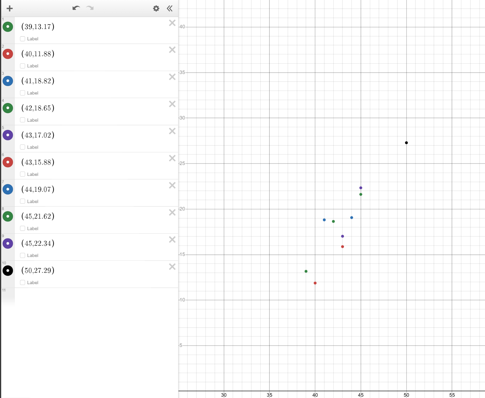

# 🍦 Temperature vs. Ice Cream Sales - Linear Regression Project

This project explores the relationship between **temperature** and **ice cream sales** using linear regression analysis. It includes data visualization, model training, and interpretation of results.

---

## 📈 Problem Statement

Is there a predictable pattern between rising temperatures and the increase in ice cream sales?

This project uses a small dataset to study that correlation and builds a **linear regression model** to predict ice cream sales based on temperature.

---

## 📊 Dataset

A simple dataset representing daily temperature (in °C) and corresponding ice cream sales (in ₹ or $). Sample format:

| Temperature (°C) | Ice Cream Sales |
|------------------|-----------------|
| 20               | 200             |
| 25               | 330             |
| 30               | 500             |
| ...              | ...             |

---

## 🧠 Methodology

1. **Data Analysis**:
   - Dataset loaded using Python.
   - Scatter plot created to visualize correlation.

2. **Model Building**:
   - Linear Regression implemented using `scikit-learn`.
   - Coefficients and intercept calculated.

3. **Desmos Graphs**:
   - Graphs plotted on Desmos to visually confirm the linear pattern.
   - Interactive visualization included.

4. **Model Evaluation**:
   - Predictions vs. Actual values compared.
   - Mean Squared Error (MSE) or R² score calculated to assess accuracy.

---

## 🔗 Desmos Visualization

View the graph on Desmos:  
  


---

## 💻 How to Run

1. Clone the repository:
   ```bash
   git clone https://github.com/your-username/temp-vs-icecream-sales.git
   cd temp-vs-icecream-sales

# 2. Install dependencies
pip install -r requirements.txt

# 3. Run the analysis
python regression_model.py

